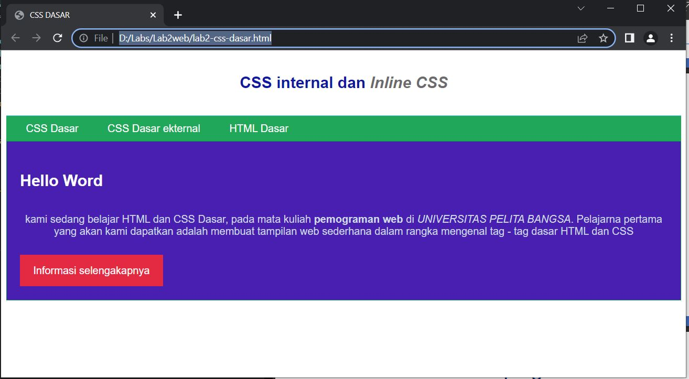
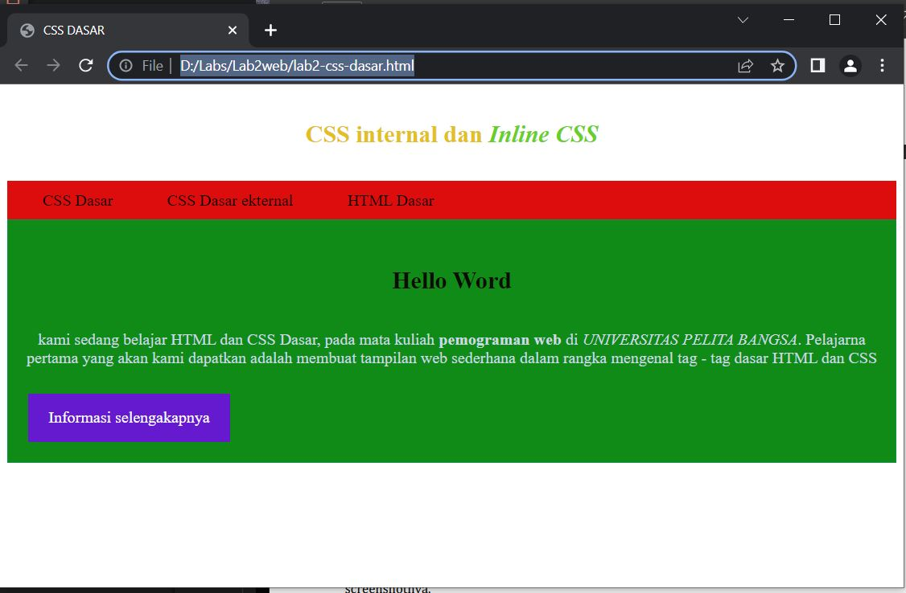
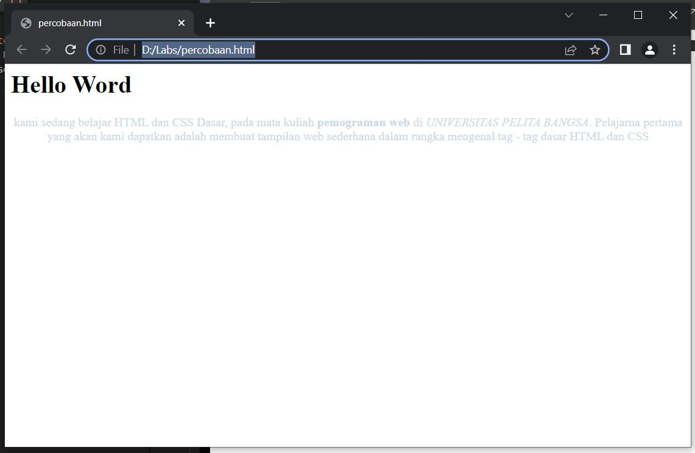
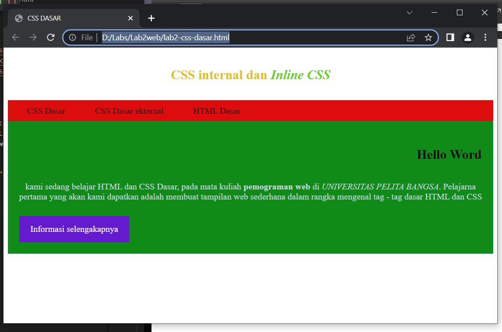
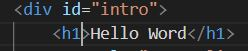
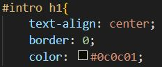
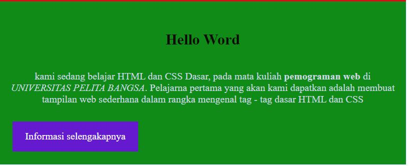
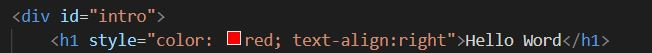
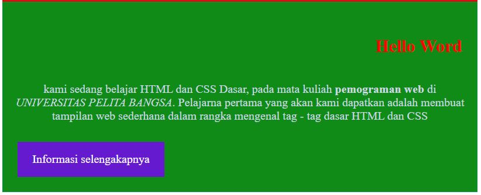
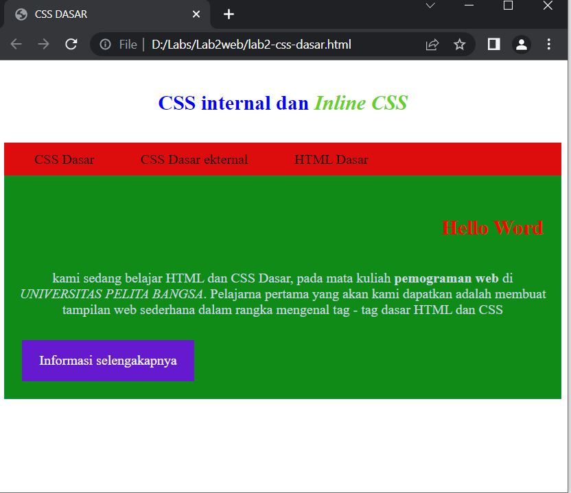

# Lab2web
NAMA    : ADITIA YUDA KARTika
NIM     : 312110334

# TUGAS PRAKTIKUM 2

1. Melakukan perubahan warna dan pemformatan text
berikut adalah hasilnya
sebelum

sesudah

2. Perbedaan CSS elemen h1 (...) dan #intro h1 (...)
* untuk CSS elemen h1 (...), memiliki fungsi untuk menampilkan judul berupa text 

seperti pada contoh kata 'Hello Word' di atas
* untuk CSS elemen #intro h1 (...), memiliki fungsi untuk melakukan pemformatan text, merubah warna background, merubah warna text tersebut juga

3. deklarasi yang akan di tampilkan pada browser adalah deklasi inline CSS, berikut adalah contohnya:
* berikut adalah hasil output saat memakai eksternal CSS:
* codingan

* output

* berikut adalah hasil saat menggunakan inline CSS:
* codingan

* output
berubah dan menampilkan deklarasi pada inline CSS

4. deklarasi yang akan di tampilkan pada browser adalah CLASS
berikut hasilnya

* outputnya

saat dilakukan pembalikan id dan class tidak terdapat perubahan
jadi dapat disimpulkan class yang akan tampil di browser